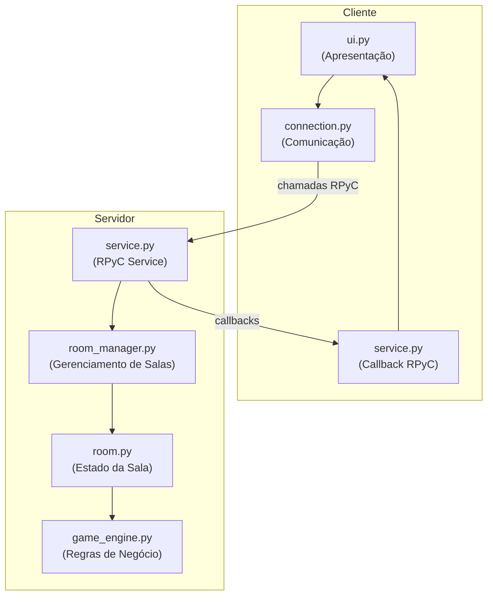
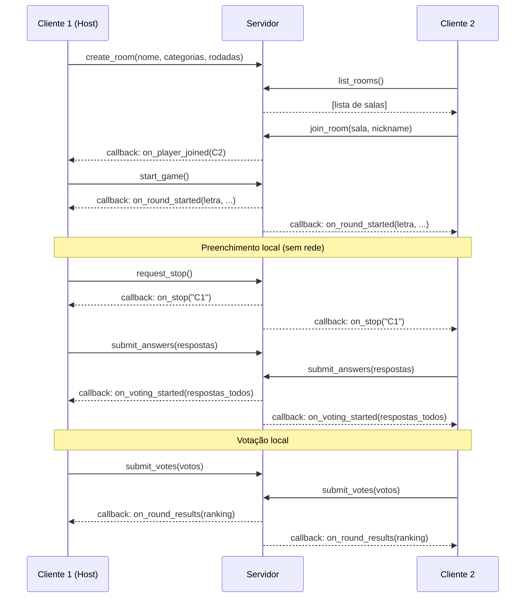

# STOPOTS — Jogo de Adedonha Online (Terminal + RPyC)

Recriação do jogo STOPOTS (Adedonha) como aplicação cliente-servidor em Python, utilizando a biblioteca RPyC para comunicação em rede. Interface inteiramente via terminal.

---

## Requisitos Funcionais

### RF01 — Gerenciamento de Salas
- **RF01.1**: O servidor deve manter uma lista de salas ativas e permitir a criação de novas salas sob demanda de um cliente.
- **RF01.2**: O cliente que cria a sala define: **nome da sala**, **categorias** (lista de strings) e **número de rodadas**.
- **RF01.3**: Qualquer cliente pode listar as salas disponíveis (que ainda não iniciaram partida) e entrar em uma delas.
- **RF01.4**: O servidor deve remover salas que ficarem vazias (0 jogadores) ou que tenham apenas 1 jogador após o início da partida.

### RF02 — Conexão e Lobby
- **RF02.1**: Cada cliente se identifica com um **nickname** único (validado pelo servidor).
- **RF02.2**: O cliente que criou a sala é o **host** e é o único que pode iniciar a partida.
- **RF02.3**: Todos os jogadores no lobby podem ver a lista de jogadores conectados à sala.
- **RF02.4**: A partida só pode ser iniciada com **2 ou mais jogadores**.

### RF03 — Fluxo de uma Rodada
- **RF03.1**: No início de cada rodada, o servidor **sorteia uma letra** aleatória (A-Z, excluindo letras difíceis como K, W, Y opcionalmente).
- **RF03.2**: O servidor notifica todos os clientes da letra sorteada e inicia a fase de preenchimento.
- **RF03.3**: O **tempo limite de preenchimento** é de `20 segundos × número de categorias`.
- **RF03.4**: O cliente preenche as palavras para cada categoria localmente.
- **RF03.5**: O cliente pode acionar o **STOP** a qualquer momento, desde que **todas as categorias estejam preenchidas**. Caso contrário, recebe um aviso local para preencher as categorias faltantes.
- **RF03.6**: Quando um cliente aciona o STOP **ou** o tempo limite expira, o servidor encerra a fase de preenchimento para **todos** os jogadores.
- **RF03.7**: Ao receber o sinal de STOP do servidor, o cliente envia as palavras preenchidas até o momento.

### RF04 — Fase de Votação
- **RF04.1**: Após receber todas as respostas, o servidor distribui as palavras de cada jogador para todos votarem.
- **RF04.2**: Para cada categoria, cada jogador vê as respostas dos **outros** jogadores e vota se a palavra é **válida** ou **inválida**. Para votar, o sistema espera um input de tecla: 'v' para válido e 'i' para inválido.
- A votação acontece por rodadas, onde cada rodada verifica as respostas de uma categoria. Ao final de todas as rodadas de votação, inicia-se uma nova rodada de partida, sorteando uma letra e prosseguindo.
- **RF04.3**: O tempo limite de votação é de **15 segundos** (por categoria).
- **RF04.4**: Se o tempo de votação esgotar, votos não enviados são considerados como **"válidos"** (aprovação por padrão).
- **RF04.5**: Uma palavra é considerada **inválida** se a **maioria** dos jogadores votou contra ela.

### RF05 — Pontuação
- **RF05.1**: Palavra **válida e única** (nenhum outro jogador usou a mesma palavra na mesma categoria): **10 pontos**.
- **RF05.2**: Palavra **válida mas repetida** (outro jogador usou a mesma palavra na mesma categoria): **5 pontos**.
- **RF05.3**: Palavra **inválida** (reprovada por votação) ou **em branco**: **0 pontos**.
- **RF05.4**: Ao final de cada rodada, o servidor exibe o **ranking atualizado** com a pontuação acumulada de cada jogador.

### RF06 — Fim de Partida
- **RF06.1**: A partida termina após todas as rodadas serem completadas.
- **RF06.2**: O servidor exibe o **ranking final** e declara o **vencedor** (jogador com maior pontuação total).
- **RF06.3**: O servidor encerra automaticamente uma partida se restar apenas **1 ou 0 jogadores** após o início.

---

## Requisitos Não Funcionais

### RNF01 — Desempenho e Comunicação
- **RNF01.1**: Minimizar tráfego de rede — o preenchimento de palavras é feito **localmente** e enviado ao servidor apenas na finalização (STOP ou timeout).
- **RNF01.2**: A votação é consolidada em **uma única mensagem** por jogador. A votação acontece por categoria: todas as palavras preenchidas para aquela categoria por cada jogador são dispostas para serem votadas como válidas ou inválidas. A fase de votação acaba quando todas as categorias forem mostradas. 
- **RNF01.3**: O servidor utiliza **callbacks RPyC** para notificar clientes de eventos (início de rodada, STOP, resultados), evitando polling.

### RNF02 — Modularidade e Separação de Responsabilidades
- **RNF02.1**: A lógica de **comunicação de rede** (RPyC services) deve estar **separada** da lógica de **regras de negócio** (game engine).
- **RNF02.2**: O código deve seguir uma arquitetura em camadas: **Apresentação (UI)** → **Lógica de Negócio** → **Comunicação**.
- **RNF02.3**: Cada módulo deve ter responsabilidade única e bem definida.

### RNF03 — Robustez
- **RNF03.1**: O servidor deve tratar **desconexões abruptas** de clientes sem travar a partida.
- **RNF03.2**: Timeouts devem ser controlados pelo **servidor** (source of truth), não pelo cliente.
- **RNF03.3**: O servidor deve validar todas as entradas recebidas dos clientes.

### RNF04 — Usabilidade (Terminal)
- **RNF04.1**: Interface de terminal clara, com separadores visuais e feedback imediato.
- **RNF04.2**: Exibir **timer visual** durante fases de preenchimento e votação.
- **RNF04.3**: Mensagens de status claras para cada transição de estado do jogo.

### RNF05 — Tecnologia
- **RNF05.1**: Linguagem: **Python 3.10+**
- **RNF05.2**: Comunicação: **RPyC**
- **RNF05.3**: Interface: **Terminal** (sem GUI)
- **RNF05.4**: Sem dependências externas além de RPyC (usar apenas stdlib + RPyC).

---

## Arquitetura e Estrutura de Módulos

```
proj-final/
├── server/
│   ├── __init__.py
│   ├── main.py                 # Entry point do servidor
│   ├── service.py              # RPyC Service exposto aos clientes
│   ├── room_manager.py         # Gerenciamento de salas (criar, listar, remover)
│   ├── room.py                 # Classe Room (estado da sala e jogadores)
│   └── game_engine.py          # Motor de jogo: rodadas, STOP, pontuação, votação
│
├── client/
│   ├── __init__.py
│   ├── main.py                 # Entry point do cliente
│   ├── service.py              # RPyC Service de callback (receber notificações)
│   ├── connection.py           # Camada de comunicação (wraps RPyC calls)
│   └── ui.py                   # Interface de terminal (input/output, menus, timer)
│
├── shared/
│   ├── __init__.py
│   ├── constants.py            # Constantes compartilhadas (tempos, regras de pontuação)
│   └── models.py               # Modelos de dados (dataclasses para respostas, votos, etc.)
│
├── requirements.txt            # rpyc
└── README.md
```

### Diagrama de Camadas



---

## Plano de Implementação

### Fase 1 — Fundação (shared + estrutura básica)

#### [NEW] [constants.py](file:///home/yuri/Área de trabalho/Faculdade/redes-neurais/proj-final/shared/constants.py)
- Constantes globais:
  - `FILL_TIME_PER_CATEGORY = 20` (segundos)
  - `VOTE_TIME = 15` (segundos)
  - `POINTS_UNIQUE = 10`, `POINTS_REPEATED = 5`, `POINTS_INVALID = 0`
  - `MIN_PLAYERS = 2`
  - `DEFAULT_CATEGORIES = ["Nome", "Animal", "Fruta", "Cidade", "Objeto", "Cor"]`
  - `ALPHABET` — letras válidas para sorteio
  - `SERVER_PORT = 18861`

#### [NEW] [models.py](file:///home/yuri/Área de trabalho/Faculdade/redes-neurais/proj-final/shared/models.py)
- Dataclasses serializáveis:
  - `RoomInfo(name, host, categories, num_rounds, player_count, status)`
  - `RoundResult(player_scores: dict, ranking: list, round_number: int)`
  - `PlayerAnswers(nickname: str, answers: dict[str, str])` — categoria → palavra
  - `VotePayload(votes: dict[str, dict[str, bool]])` — categoria → {jogador: válido?}
  - `GameState` enum: `LOBBY, FILLING, VOTING, ROUND_END, GAME_OVER`

---

### Fase 2 — Servidor: Lógica de Negócio

#### [NEW] [game_engine.py](file:///home/yuri/Área de trabalho/Faculdade/redes-neurais/proj-final/server/game_engine.py)
Motor de jogo puro (sem nenhuma dependência de RPyC):
- `draw_letter(used_letters: set) -> str` — sorteia letra não usada
- `calculate_scores(all_answers: dict[str, PlayerAnswers], votes: dict[str, VotePayload]) -> dict[str, int]` — calcula pontos da rodada
- `is_word_valid(word: str, letter: str) -> bool` — valida se a palavra começa com a letra correta
- `determine_winner(accumulated_scores: dict[str, int]) -> str` — determina vencedor
- `tally_votes(votes: dict[str, VotePayload], num_players: int) -> dict[str, dict[str, bool]]` — consolida votos por maioria

#### [NEW] [room.py](file:///home/yuri/Área de trabalho/Faculdade/redes-neurais/proj-final/server/room.py)
Classe `Room` que encapsula o estado de uma sala:
- Atributos: `name, host, categories, num_rounds, current_round, players: dict, state: GameState, used_letters, accumulated_scores, current_answers, current_votes, letter`
- Métodos:
  - `add_player(nickname, callback)` / `remove_player(nickname)`
  - `start_game()` — valida min_players, muda estado para rodada
  - `start_round()` — sorteia letra, reseta respostas, inicia timer
  - `submit_answers(nickname, answers)` — armazena respostas de um jogador
  - `request_stop(nickname) -> bool` — registra pedido de STOP
  - `submit_votes(nickname, votes)` — armazena votos de um jogador
  - `end_filling_phase()` — encerra preenchimento e inicia votação
  - `end_voting_phase()` — calcula pontuação e gera ranking
  - `notify_all(event, data)` — notifica todos os jogadores via callbacks
  - `check_player_count()` — encerra partida se < 2 jogadores

#### [NEW] [room_manager.py](file:///home/yuri/Área de trabalho/Faculdade/redes-neurais/proj-final/server/room_manager.py)
Classe `RoomManager`:
- `create_room(name, host, categories, num_rounds) -> Room`
- `list_rooms() -> list[RoomInfo]`
- `get_room(name) -> Room | None`
- `remove_room(name)`
- `join_room(room_name, nickname, callback) -> bool`

---

### Fase 3 — Servidor: Camada de Comunicação RPyC

#### [NEW] [service.py](file:///home/yuri/Área de trabalho/Faculdade/redes-neurais/proj-final/server/service.py)
Classe `StopotsService(rpyc.Service)`:
- **Métodos expostos** (chamados pelos clientes):
  - `exposed_create_room(name, categories, num_rounds, nickname, callback)` — cria sala e registra host
  - `exposed_list_rooms()` — retorna lista de `RoomInfo`
  - `exposed_join_room(room_name, nickname, callback)` — entra na sala
  - `exposed_leave_room(nickname)` — sai da sala
  - `exposed_start_game(nickname)` — inicia partida (apenas host)
  - `exposed_submit_answers(nickname, answers)` — envia respostas
  - `exposed_request_stop(nickname)` — solicita STOP
  - `exposed_submit_votes(nickname, votes)` — envia votos
- **Timers**: usa `threading.Timer` para controlar timeout de preenchimento e votação
- Delega toda lógica ao `RoomManager` / `Room` / `GameEngine`

#### [NEW] [main.py (servidor)](file:///home/yuri/Área de trabalho/Faculdade/redes-neurais/proj-final/server/main.py)
- Instancia `RoomManager`
- Inicia `ThreadedServer` na porta configurada
- Trata `KeyboardInterrupt` para shutdown graceful

---

### Fase 4 — Cliente: Comunicação e Callbacks

#### [NEW] [connection.py](file:///home/yuri/Área de trabalho/Faculdade/redes-neurais/proj-final/client/connection.py)
Classe `ServerConnection`:
- Abstrai chamadas RPyC ao servidor:
  - `connect(host, port)` / `disconnect()`
  - `create_room(...)`, `list_rooms()`, `join_room(...)`, `leave_room()`
  - `start_game()`, `submit_answers(answers)`, `request_stop()`, `submit_votes(votes)`
- Trata erros de comunicação e reconexão

#### [NEW] [service.py (cliente)](file:///home/yuri/Área de trabalho/Faculdade/redes-neurais/proj-final/client/service.py)
Classe `ClientCallbackService(rpyc.Service)`:
- **Métodos expostos** (chamados pelo servidor via callback):
  - `exposed_on_player_joined(nickname)` — jogador entrou na sala
  - `exposed_on_player_left(nickname)` — jogador saiu
  - `exposed_on_game_started()` — partida iniciada
  - `exposed_on_round_started(letter, round_num, total_rounds, time_limit)` — nova rodada
  - `exposed_on_stop(who_stopped)` — STOP acionado
  - `exposed_on_voting_started(all_answers, time_limit)` — fase de votação
  - `exposed_on_round_results(results: RoundResult)` — resultados da rodada
  - `exposed_on_game_over(final_ranking)` — fim de partida
  - `exposed_on_game_cancelled(reason)` — partida cancelada
- Cada callback seta flags/eventos (`threading.Event`) que a UI consome

---

### Fase 5 — Cliente: Interface de Terminal

#### [NEW] [ui.py](file:///home/yuri/Área de trabalho/Faculdade/redes-neurais/proj-final/client/ui.py)
Classe `TerminalUI`:
- **Menu principal**: Criar sala / Listar salas / Entrar em sala / Sair
- **Lobby**: Mostra jogadores, aguarda início (host vê opção "Iniciar Partida")
- **Fase de preenchimento**:
  - Exibe letra sorteada e categorias
  - Input sequencial para cada categoria
  - Timer visual (atualizado em thread separada)
  - Opção STOP (com validação local: todas as categorias preenchidas?)
  - Ao receber sinal de STOP do servidor, interrompe input e envia respostas preenchidas até o momento
- **Fase de votação**:
  - Exibe respostas dos outros jogadores por categoria
  - Para cada resposta: `[V]álida / [I]nválida`
  - Timer visual
- **Resultados**: Exibe tabela com pontuação da rodada e ranking acumulado
- **Fim de jogo**: Exibe ranking final e vencedor

#### [NEW] [main.py (cliente)](file:///home/yuri/Área de trabalho/Faculdade/redes-neurais/proj-final/client/main.py)
- Pede IP do servidor e nickname
- Instancia `ServerConnection`, `ClientCallbackService` e `TerminalUI`
- Loop principal do menu

---

## Fluxo de Comunicação em Rede (Sequência)



> [!NOTE]
> Observe que durante o preenchimento **não há comunicação de rede**. As palavras são digitadas localmente e enviadas apenas ao final (STOP ou timeout). Isso minimiza o tráfego como requisitado.

---

## Mecanismos de Sincronização

| Fase | Controle | Mecanismo |
|---|---|---|
| Preenchimento | Servidor controla o timer global | `threading.Timer` no servidor; ao expirar, chama `on_stop` em todos os clientes |
| STOP antecipado | Cliente valida localmente → servidor propaga | Cliente verifica categorias → `request_stop()` → servidor envia callback `on_stop` para todos |
| Coleta de respostas | Servidor aguarda todas ou timeout (5s extra) | Após STOP, servidor dá 5s extras para receber respostas pendentes |
| Votação | Servidor controla timer de 15s | `threading.Timer` no servidor; votos ausentes = aprovação |
| Desconexão | Servidor detecta via RPyC | `on_disconnect` remove jogador e verifica `check_player_count` |

---

## Sistema de Pontuação (Detalhado)

```
Para cada categoria:
  1. Servidor normaliza as respostas (lowercase, strip)
  2. Verifica se começa com a letra sorteada
  3. Aplica resultado da votação (maioria reprova → inválida)
  4. Compara com respostas dos outros jogadores:
     - Palavra válida e única → 10 pts
     - Palavra válida e repetida → 5 pts
     - Palavra inválida / em branco → 0 pts
```

---

## User Review Required

> [!IMPORTANT]
> **Letras excluídas do sorteio**: Por padrão, pensei em excluir K, W e Y do sorteio por serem letras com poucas palavras em português. Deseja manter essa exclusão ou incluir todas as letras A-Z?

> [!IMPORTANT]
> **Desconexão durante partida**: Um jogador que desconectar durante a partida será removido e suas respostas descartadas. Deseja permitir reconexão ou manter essa abordagem simples?

## Open Questions

> [!NOTE]
> **Quantidade máxima de jogadores por sala**: Há um limite desejado ou será ilimitado?

> [!NOTE]
> **Persistência**: Não está previsto salvar dados em disco (sem banco de dados). Tudo em memória. Correto?

> [!NOTE]
> **Letras repetidas entre rodadas**: O plano atual evita repetir letras dentro da mesma partida. Se o número de rodadas exceder o número de letras disponíveis, devemos reciclar letras. Isso está ok?

---

## Verificação

### Testes Manuais
1. Iniciar servidor e conectar 2+ clientes em terminais separados
2. Criar sala, entrar, iniciar partida
3. Preencher categorias e testar STOP manual e automático (timeout)
4. Verificar votação e pontuação
5. Testar desconexão de jogador durante partida
6. Verificar ranking final após todas as rodadas
7. Testar criação de múltiplas salas simultâneas

### Validações Automatizadas
- Testes unitários para `game_engine.py` (pontuação, votação, sorteio de letra) — sem dependência de rede
- Testes unitários para `room.py` (transições de estado, validações)
